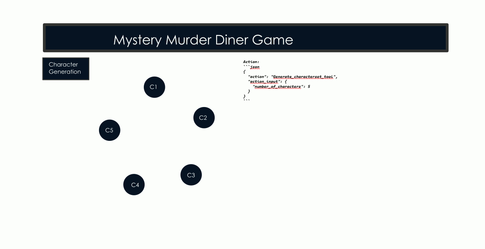
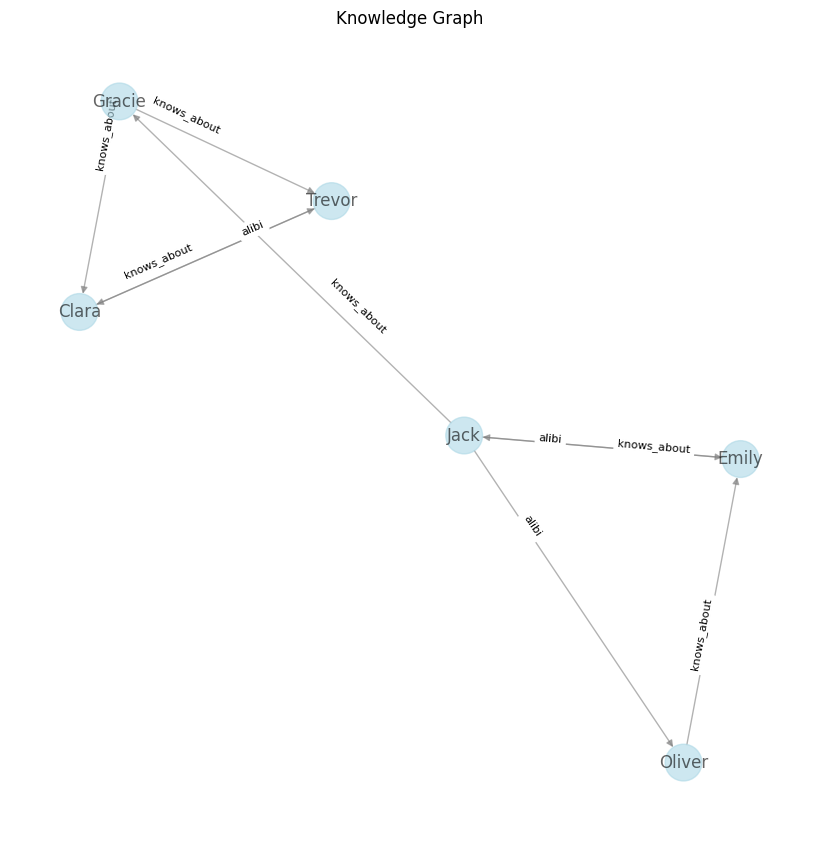
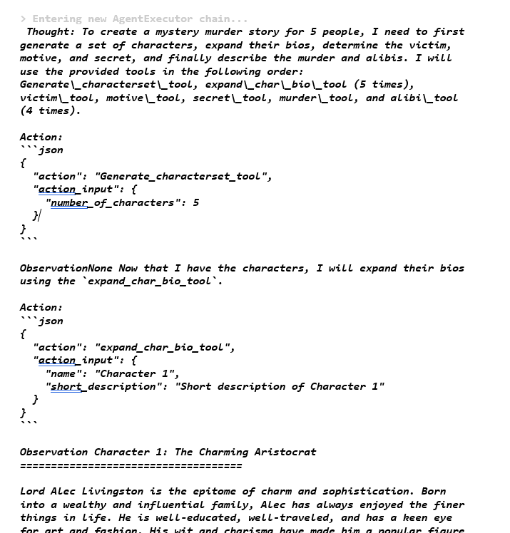

# Mystery Murder diner games with AI

The objective of this project is to demonstrate llm capabilities to generate complex interrelated stories.

Mystery Murder Dinner Games are Agatha Christie inspired Rol games where each person plays a character involved into a murder. The story has multiple interrelated characters with different motives and stories. To provide an interesting game play all characters must have information about the relation of other characters with the victim. Also, we must provide means to the players to resolve the murder. 

From the AI perspective there are several challenges for generating this Rol-game: 
- Logical consistency must be maintained along several prompts. 
- Problem complexity grows with the number of players. 
- Complex information must be transferred between prompts. 




# Chain based solution

First approach to the problem is using a chain of prompts to create the story. The following prompts are defined: 
- Character Creation 
- Victim Generation
- Motive Generation for each character. 
- Secrets: each character knows a secret of the relation of other character with the victim. 
- Murder circumstances: time of murder and murderer selection 
- Alibis: each character is able a to exculpate another character from the murder. The murderer is not exculpated by any alibi. 

# Graph consistency check

To check the consistency of the story LLM are used to create a knowledge graph with all the variables of the story. this knowledge graph can be represented in a diagram to quick review the story. 



# Agent based solution

Due to the high complexity of the stories a lot of inconsistencies are found. Those inconsistencies could be solved easily with a manual review, but an automatic solution should be made. REACT Agents technology allow the system to review the story using the knowledge graph and regenerate the inconsistent parts. 

Several emerged behaviors have emerged from the use of agents. One of the most interesting is that the model started using generic names for characters. e.g. Character 1, Character 2, etc... This resulted in a more consistent reference to the characters among the calls. Chains had the problem of using full names to reference other characters and successive calls had problems if the name had slightly changed. 

 "Example agent execution")

# running
create env_keys file with this line

```
NVIDIA_API_KEY='nvapi-xxxxxxxxxxxxx'
```

install requirements

```
pip install -r requirements
```

for running the chain based tool we run 

```
python generate1.py
```

for running the agent based tool we run

```
python generate_with_agent.py 
```

# Example results

[chain based result](example/story.md)

[agend based result](example/agent_result.md)


# chars structure
```
chars_final = [ {"name": 
                "short":
                "long_bio": 
                "motive": 
                "secret":
                }]
victim ={"name": 
        "short":
        "long_bio":}

murderer: int
```
